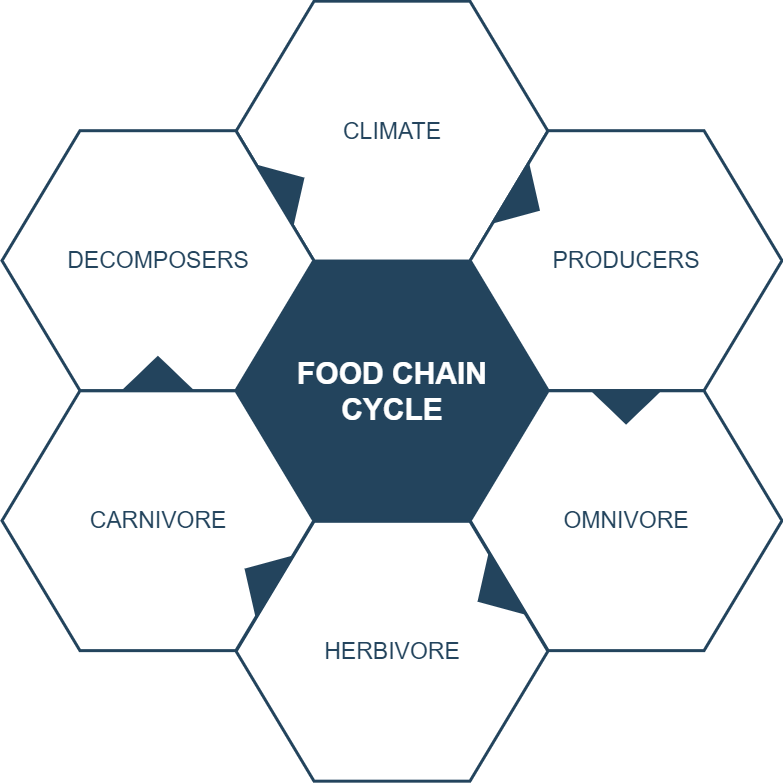

## Markup created using the rich text editor


Original was roughly in order of appearance on the Confluence rich text editor toolbar, from left to right.

Order now is in order of commonly used to more exotic (such that 'todo' are in the end'

### Markup that uses the same names as XHTML


Paragraph

#### Markup: Headings


Headings are a special type of block element.

# Heading 1


## Heading 2


### Heading 3


#### Heading 4


##### Heading 5


###### Heading 6


#### Markup: Block elements


```text
Preformatted line 1<br>

Preformatted line 2<br>

Preformatted line 3
```


#### Markup: Inline elements


**Bold** 

*Italic* 

<u>Underline</u> 

Colour

~~Strike~~through

~Sub~script

^Super^script

<pre>Monospace</pre> 

**Bold** *Italic* <u>Underline</u> Colour ~~Strike~~through ~Sub~script ^Super^script <pre>Monospace</pre> 

#### Markup: Lists


  * Bullet list item


    * Bullet list item level 2


      * Bullet list item level 3
      * Bullet list item level 3
    * Bullet list item level 2
  * Bullet list item


  1. Numbered list item
    

Paragraph nested in list item

Paragraph nested in list item  
  1. Numbered list item

#### Markup: Indent


Paragraph (indented once)

Paragraph (indented twice)


  1.  


    1. Numbered list item (indented once) 

##### Heading 5 (indented once)


#### Markup: Alignment


Paragraph (align left)

Paragraph (align center)

Paragraph (align right)

##### Heading 5 (align center)


  * Bullet list item (align center)

#### Markup: Links to web page


[Link to Google](http://www.google.com/) 

#### Markup: Table simple


|Column heading 1|Column heading 2|
| -- | -- |
|Cell 1 Row 1 (spans two rows)|Cell 2 Row 1 (highlighted)|
|Cell 2 Row 2|
|Cell 1 Row 3 (spans two columns)|


#### Real life examples (decision table)


option 1


  * option 1 action 1
  * option 1 action 2
  * option 1 action 3
  * option 1 action 4

      
      
      
      
  
      
|optie|option 1|Option 2|third option|
| -- | -- | -- | -- |
  
|Perfomance|

|     |     |     |
| --- | --- | --- |
|++|+|-|
|Reliability|-|-|++|
|user friendlyness|+|+|-|
|Total score|1|2|4|


#### Markup: Table real life


|     |     |
| --- | --- |
|**A**|**B**|
|blah blah blah blah|abc def ghi j klm nop qrs tuv w xyz|
|**C>C2**|**D**|
|blah blah blah blah|abc def ghi j klm nop qrs tuv w xyz|
|**E**|**F**|
|blah blah blah blah|abc def ghi j klm nop qrs tuv w xyz|


#### Markup: Details macro


<br>
   

|     |     |
| --- | --- |
|id|ID|
|level|B |
|deadline|2023-6-1|
|owner|User|
|ticket|<br>|


<br>

#### Markup: warning


#### Markup: Symbols


#### Markup: Horizontal line

----


#### Markup: Line break


Line<br> break

### Proprietary Confluence markup (ac:* and ri:* elements)


#### Markup: Links


Link to page:

[Page title](Page title) 

Case: simple 
[Page title](Page title) embedded in tekst

Link to user:

 

Link to attachment:

[test.txt] 

Link to external page:

[http://www.google.com/](http://www.google.com/) 

#### Markup: Images


Image on web:

 

Image attached to this page:

 

#### Markup: Emoticons


:) :( :P :D ;) 

(y) (n) (i) (/) (x) 

(!) (Emoticon: plus) (Emoticon: minus) (Emoticon: question) (Emoticon: light-on) 

(Emoticon: light-off) (Emoticon: yellow-star) (Emoticon: red-star) (Emoticon: green-star) (Emoticon: blue-star) 

#### Markup: Code Block macro

{code:language=html/xml}
<xml>Content</xml>
{code}


#### Markup: Section and Column macros

{section:border=true}
{column:width=50%}

Left column{column}
{column:width=50%}

Right column{column}
{section}


# Structured Macro's


## Drawio macro
{width=1719}


## info macro


# TODO sectie


The quote need to be redendered with < in front for the full quote


#### todo: quote
>
{quote}
  

Quote
{quote}
